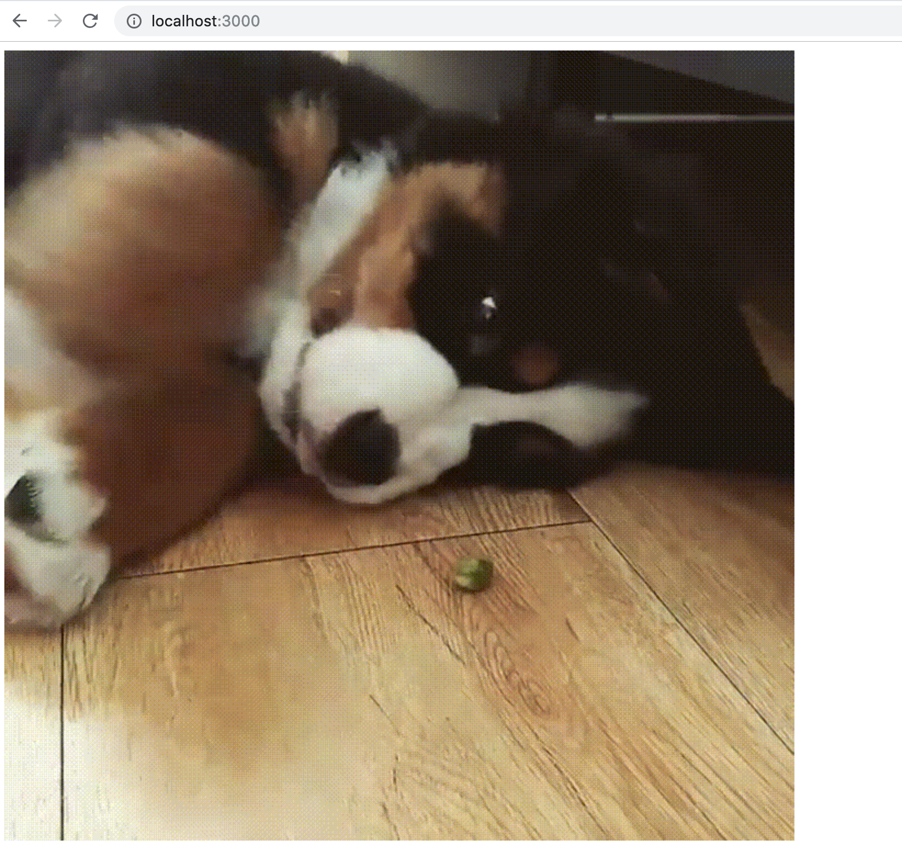
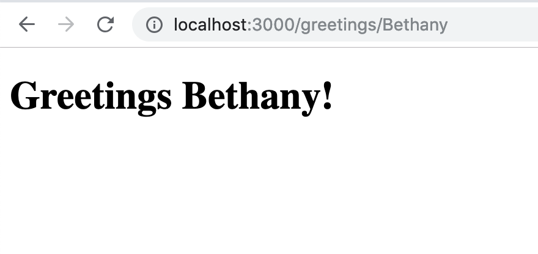

Now that our NodeJS environment is up and running and we have a basic hello world running in Express, let's extend that with some basic **middleware** like a templating engine.

# Add your First Middleware - a Template Engine

ExpressJS is a light weight or **unopinionated** web framework, meaning it does not make decisions for you, it lets the developer decide on what plugins to use. These plugins or libraries we use to extend a web framework are called **middleware**. The first piece of middleware we are going to add is a template engine so we can render HTML templates.

We're going to use [Handlebars.js](http://handlebarsjs.com/) - a minimalistic, logic-less templating library for server-side templating. Handlebars.js is a stand-alone library, but to use it in the context of ExpressJS we can use the [express-handlebars](https://github.com/ericf/express-handlebars) library.

> [action]
>
> Install `express-handlebars`
>
```bash
$ npm install express-handlebars --save
```

Now that it's installed, let's add handlebars to the `Middleware` section of `app.js`:

> [action]
>
> Put the following code directly below the `// Middleware` section of `app.js`:
>
```js
// Middleware
const exphbs  = require('express-handlebars');
>
app.engine('handlebars', exphbs({defaultLayout: 'main'}));
app.set('view engine', 'handlebars');
```

This "middleware" library will be used to allow Express (our web framework) to render HTML templates and send them back to the client using a new function: `res.render('template-name', { variables })`

# Views & Layout Folder Structure

> [action]
>
> Create a folder called `views` and in that folder create a folder called `layouts`. Inside your `layouts` folder create a file called `main.handlebars`.

So your file structure should look like this:

```
.
├── app.js
└── views
    ├── hello-gif.handlebars
    └── layouts
        └── main.handlebars
```

Now let's build out `main.handlebars`. Note that the triple brackets `{{{}}}` render html of the sub-template we will pass into this layout template (we'll dive deeper into this later).

> [action]
>
> Add the following into `views/layouts/main.handlebars`:
>
```html
<!DOCTYPE html>
<html>
<head>
    <meta charset="utf-8">
    <title>Example App</title>
</head>
<body>
>
    {{{body}}}
>
</body>
</html>
```

# Update Your Hello World Route

Let's update the our main route from displaying text to showing a gif:

> [action]
>
> Edit the `// Routes` code in `app.js` to be the following:
>
```js
app.get('/', (req, res) => {
  // set the url of the gif
  const gifUrl = 'https://media1.tenor.com/images/ace67f6147cf0ab6e625dcaac1c8e060/tenor.gif?itemid=14039077'
  // render the hello-gif view, passing the gifUrl into the view to be displayed
  res.render('hello-gif', { gifUrl })
})
```
>
> Before we test this, define a new template in the `views` folder called `hello-gif.handlebars` that will display the gif image.
>
```html
<!-- hello-gif.handlebars -->
>
<!-- show a gif passed from the route -->

```

Reload your browser, and you should now see an adorable gif in place of the text!



# URL Parameters in Another Route

Let's add another route. This time let's use a variable in the route in order to say "greetings" to whoever is in the path.

> [action]
> Add a new GET route underneath the `// Routes` section of `app.js` so when you go to `/greetings/Bethany` your page should say "Greetings Bethany!"
>
```js
// app.js
>
...
>
// Routes
...
>
app.get('/greetings/:name', (req, res) => {
  // grab the name from the path provided
  const name = req.params.name;
  // render the greetings view, passing along the name
  res.render('greetings', { name });
})
```
> Before we test this, define a new template in the `views` folder called `greetings.handlebars` that will display the name from the path.
>
```html
<!-- greetings.handlebars -->
<h1>Greetings {{name}}!</h1>
```

Try going to `localhost:3000/greetings/Bethany` (or any name of your choosing) and make sure you see a greeting!



Great work! We added some views, and also made some more complex routes that pass variables into our layouts! Let's make sure to save our progress:

# Now Commit

>[action]
>
```bash
$ git add .
$ git commit -m 'adding middleware'
$ git push
```
